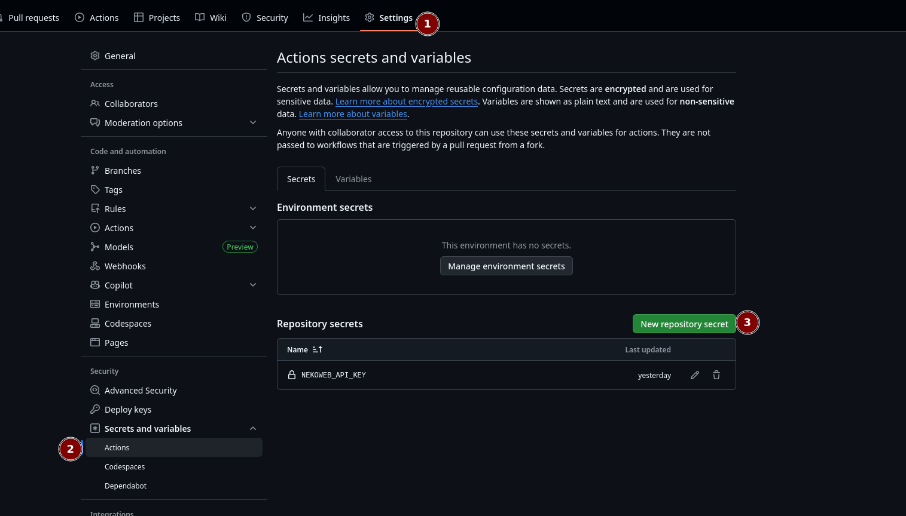
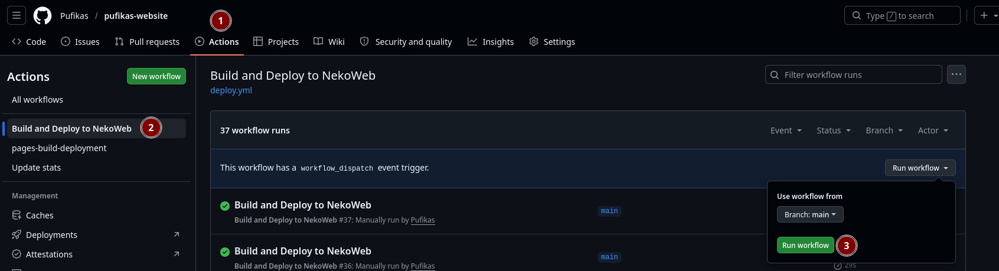

# Simple deploy script
Zip all your repository and upload it to your nekoweb dashboard

## Using this script
Create a workflow inside your repository
`.github/workflows/deploy.yml`

**example deploy.yml**
Replace `nekoweb-domain` and `nekoweb-username` with your own values
```yml 
name: Build and Deploy to NekoWeb

on:
  push:
    branches:
      - main

jobs:
  build:
    runs-on: ubuntu-latest

    steps:
      - name: Checkout Code
        uses: actions/checkout@v4

      - name: Deploy
        uses: Pufikas/deploytonekoweb@main
        with:
          nekoweb-api-key: ${{ secrets.NEKOWEB_API_KEY }}
          nekoweb-domain: "pufikas.nekoweb.org"
          nekoweb-username: "pufikas"
          compression-level: 6
```

# Setting your **NEKOWEB_API_KEY**
Get api key from https://nekoweb.org/api

Add your API key to your repository secrets:


**Settings -> Secrets and variables -> Actions -> New repository secret**

**Name `NEKOWEB_API_KEY`**
**Secret `yourapikey`**

## Required inputs
```yml
inputs:
  nekoweb-api-key:
    description: "Your NekoWeb API key."
    required: true
  nekoweb-domain:
    description: "Your NekoWeb domain to deploy to."
    required: true
  nekoweb-username:
    description: "Your NekoWeb username."
    required: true
  ignore-paths: "Comma-separated list of folders/files to exclude from ZIP"
    required: false
  compression-level:
    description: "0-9 level range of compression, 9 is the slowest and highest compression"
    required: true
    default: 6
    ...
```
## inputs example
folders
```yml
ignore-paths: "assets/bg, assets/cursors, assets/fonts, assets/misc, assets/themes, assets/webring"
```
or single files
```yml
ignore-paths: "assets/bg/cloud.png"
```


## Example
```yml
name: Build and Deploy to NekoWeb

on:    
  workflow_dispatch:

jobs:
  build:
    runs-on: ubuntu-latest

    steps:
      - name: Checkout Code
        uses: actions/checkout@v4

      - name: Deploy
        uses: Pufikas/deploytonekoweb@main
        with:
          nekoweb-api-key: ${{ secrets.NEKOWEB_API_KEY }}
          nekoweb-domain: "pufikas.nekoweb.org"
          nekoweb-username: "pufikas"
          compression-level: 9
```
Run manually



### Having issues?
**Open an issue in this repository and describe your problem**